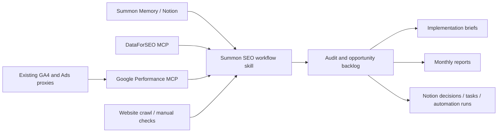

# Summon SEO and AI Visibility Build Plan

Last reviewed: 2026-07-13

## What I Reviewed

- Existing Claude SEO plugin structure in this repo.
- Existing DataForSEO extension, remote MCP service, and Claude Team connector setup.
- Summon Company Memory guidance and available Notion memory records.
- Existing Summon audit and competitor reports.
- Existing n8n/DataForSEO brand mention workflow notes.
- Existing Google Ads search terms proxy/script work.
- Current official Google API docs for GA4 Data API, Search Console API, and Google Ads API.

## Current State

Summon already has the right foundation for a serious SEO and AI visibility service:

- A Claude SEO plugin with specialist skills and agents.
- A DataForSEO MCP connector already deployed for market, competitor, keyword, SERP, and AI visibility data.
- Summon Memory in Notion for client context, source registry, decisions, and operating history.
- Some existing Google Ads proxy/script work that exports search term data into Sheets.
- Reporting and client-data conventions already emerging across Notion, Sheets, and n8n.

The missing layer is not another one-off SEO prompt. The missing layer is an operating system that turns these pieces into a repeatable service: intake, audit, opportunity finding, prioritisation, implementation briefs, QA, and reporting.

## Main Recommendation

Build the Summon SEO/GEO service as two connected layers:

1. **Workflow layer inside this repo**
   - Add Summon-specific SEO/GEO skills, agents, report templates, and QA checklists.
   - Package them into the existing Claude Team plugin.
   - This is where the team works day to day.

2. **Read-only first-party data connector under `services/`**
   - Add a new MCP service for GA4, Google Search Console, and Google Ads read-only reporting.
   - Model it on `services/dataforseo-mcp-railway`.
   - Keep credentials, OAuth tokens, client allowlists, and logs server-side.

DataForSEO remains the external market intelligence connector. The new Google connector becomes the first-party performance connector.

## Where To Build It

Use this repo as the main product home:

```text
/Users/sergeysotskiy/Documents/claude-seo
```

Recommended new structure:

```text
services/
  summon-google-performance-mcp/
    README.md
    package.json
    server.mjs
    src/
      auth/
      google/
      mcp/
      clients/
      audit-log/

extensions/
  google-performance/
    README.md
    skills/
      summon-google-performance/
        SKILL.md
    agents/
      summon-google-performance.md
    docs/
      setup-claude-team.md
      scopes-and-permissions.md

skills/
  summon-seo-service/
    SKILL.md

templates/
  summon-seo/
    intake.md
    audit-brief.md
    opportunity-backlog.md
    monthly-report.md
    implementation-brief.md
    qa-checklist.md
```

Why here:

- The repo already packages Claude Team plugins.
- The DataForSEO connector has already established the service pattern.
- The team should not have to jump between separate repos for SEO workflow logic.
- New connectors can be developed, documented, and packaged alongside the skills that use them.

## Connector Scope

Build one read-only connector called something like:

```text
summon-google-performance-mcp
```

It should expose only reporting tools.

### GA4 Tools

- `ga4_list_properties`
- `ga4_channel_performance`
- `ga4_landing_pages`
- `ga4_conversions_by_landing_page`
- `ga4_content_performance`
- `ga4_geo_device_performance`

Use GA4 Data API report methods such as `runReport`.

OAuth scope:

```text
https://www.googleapis.com/auth/analytics.readonly
```

### Google Search Console Tools

- `gsc_list_sites`
- `gsc_search_analytics`
- `gsc_queries_by_page`
- `gsc_index_coverage_summary`
- `gsc_brand_vs_nonbrand`

OAuth scope:

```text
https://www.googleapis.com/auth/webmasters.readonly
```

### Google Ads Tools

- `google_ads_list_accounts`
- `google_ads_campaign_performance`
- `google_ads_search_terms`
- `google_ads_landing_pages`
- `google_ads_keyword_performance`
- `google_ads_pmax_search_insights`, where available from existing proxy/script outputs

OAuth scope:

```text
https://www.googleapis.com/auth/adwords
```

Important: Google Ads API does not offer a separate read-only OAuth scope. Read-only safety must be enforced through account permissions, connector design, and tool-level restrictions.

## Read-Only Guardrails

The connector should be read-only by construction:

- Do not implement any mutation tools.
- Do not expose arbitrary Google Ads mutate services.
- Start with templated GAQL reports only, not free-form GAQL.
- Allowlist client IDs, GA4 property IDs, Search Console sites, and Google Ads customer IDs.
- Enforce date range limits, row limits, and pagination.
- Cache expensive or repeated requests.
- Log every connector call with client, tool, date range, account/property, row count, and user.
- Store credentials only in the deployed service, not inside the plugin ZIP.
- Keep OAuth refresh tokens encrypted.
- Use separate read-only Google users where possible.
- For Google Ads, ensure the connected MCC/user has read-only access to client accounts when possible.

## Workflow Layer

Add a Summon-specific workflow skill that turns general SEO capability into a consistent client service.

Suggested commands/workflows:

- `summon seo intake`
  - Pulls memory context.
  - Confirms client site, markets, services, CMS, analytics access, and commercial goals.
  - Produces an audit brief.

- `summon seo baseline`
  - Uses DataForSEO, GA4, GSC, Google Ads, crawl data, and manual website checks.
  - Produces a baseline scorecard.

- `summon seo technical audit`
  - Checks indexability, rendering, metadata, schema, sitemap, robots, Core Web Vitals, internal links, duplication, canonicals, and page templates.

- `summon seo content audit`
  - Maps service pages, location pages, blog clusters, intent coverage, E-E-A-T signals, and conversion alignment.

- `summon seo ppc-to-seo`
  - Uses Google Ads search terms, GA4 conversion data, GSC pages/queries, and DataForSEO keyword intelligence.
  - Finds high-intent paid terms that should become SEO landing pages or content clusters.

- `summon ai visibility baseline`
  - Checks brand/entity consistency, structured data, cited sources, answer-engine coverage, llms.txt, and content formats likely to be cited by AI systems.

- `summon seo opportunity backlog`
  - Converts findings into prioritised work items with impact, effort, confidence, owner, and evidence.

- `summon seo implementation brief`
  - Turns each approved opportunity into a developer/content brief.

- `summon seo monthly report`
  - Combines first-party performance data, DataForSEO ranking/visibility data, completed work, and next actions.

## Standard Deliverables

The service should produce the same core deliverables for every client:

- SEO/GEO intake brief.
- Baseline audit.
- Technical SEO backlog.
- Content and landing page opportunity map.
- PPC-to-SEO opportunity report.
- AI visibility/entity audit.
- Implementation briefs for approved work.
- Monthly performance and action report.

This is what makes the service trainable for a team where SEO is not the primary specialty.

## Data Flow



## How Existing Proxies Fit

Keep the current GA4 and Google Ads proxies initially. They are useful because they already prove there is client data access and reporting demand.

Use them in one of two ways:

1. **Short term**
   - Connector reads from proxy outputs or Sheets where direct API access is not ready.
   - This gets the workflow live faster.

2. **Long term**
   - Connector calls Google APIs directly.
   - Proxies become fallback sources or are retired where duplicated.

The Google Ads search terms tracker is especially useful for the `ppc-to-seo` workflow because it exposes language that already converts or receives paid demand.

## Phased Build Plan

### Phase 1: Define the service product

Output:

- Summon SEO/GEO service menu.
- Standard deliverables.
- Intake template.
- Baseline audit template.
- Opportunity backlog template.
- Monthly report template.

Build location:

- `skills/summon-seo-service/`
- `templates/summon-seo/`

### Phase 2: Build the read-only Google connector MVP

Output:

- `services/summon-google-performance-mcp`
- OAuth setup.
- GA4 read-only tools.
- Search Console read-only tools.
- Google Ads read-only reporting tools.
- Client/property/account allowlist.
- Audit logging.
- Claude Team connector setup doc.

Initial reports:

- GA4 landing pages.
- GA4 channel performance.
- GA4 conversions by landing page.
- GSC queries/pages.
- Google Ads search terms.
- Google Ads campaign and landing page performance.

### Phase 3: Add workflow orchestration

Output:

- Summon-specific Claude skill that tells agents exactly how to use Memory, DataForSEO, the Google connector, website checks, and templates.
- Specialist agents for:
  - technical SEO
  - content SEO
  - AI visibility/GEO
  - PPC-to-SEO opportunity mining
  - reporting QA

### Phase 4: Pilot on Summon and one client

Pilot order:

1. Summon website, because existing audit and competitor reports already show clear issues.
2. One client with GA4, GSC, and Google Ads access.

Success criteria:

- Team can produce a credible audit without Sergey doing all expert thinking.
- Every recommendation has source evidence.
- PPC-to-SEO opportunities are grounded in search terms and conversion data.
- AI visibility recommendations are not generic.
- Monthly report is repeatable.

### Phase 5: Operationalise

Output:

- Notion Data Sources entries for each connector/source.
- Notion Decision records for service design decisions.
- Automation Runs logging for scheduled jobs.
- Training checklist for team members.
- Example completed audits for internal reference.

## What Not To Build First

Do not start with a dashboard. The team needs repeatable judgment and deliverables first.

Do not expose arbitrary Google Ads query tools to agents in the MVP. Start with safe report templates.

Do not try to build a full SEO platform. The advantage is an agency operating system that combines expert workflow, company memory, DataForSEO, first-party data, and Claude.

## Proposed First Sprint

First sprint should be one week and should produce something usable:

1. Add `skills/summon-seo-service/SKILL.md`.
2. Add the standard templates under `templates/summon-seo/`.
3. Scaffold `services/summon-google-performance-mcp`.
4. Implement GA4 `runReport` tools.
5. Implement GSC `searchanalytics.query`.
6. Add Google Ads templated report definitions, even if backed initially by existing proxy/Sheet output.
7. Run the workflow on Summon using existing DataForSEO reports plus manual website checks.
8. Record open decisions in Notion Decisions.

## Decision Needed From Paul

The decision is not whether Summon should "do SEO" in a generic way. The better decision is:

Should Summon build a repeatable SEO and AI visibility delivery system that uses its existing paid-search strength, DataForSEO, first-party analytics, and Claude workflows?

My recommendation: yes, but start as a controlled internal product, not as a broad SEO agency promise.

The strongest positioning is:

> SEO and AI visibility for travel brands, powered by paid-search intelligence, first-party performance data, and implementation-focused audits.

That is closer to Summon's existing strengths than generic SEO retainers.

## Source Notes

- GA4 Data API supports report methods such as `runReport` and read-only analytics scopes.
- Search Console API supports OAuth and `webmasters.readonly`.
- Google Ads API uses the `adwords` OAuth scope. Read-only behaviour must be enforced through account permissions and connector implementation, not OAuth scope alone.
- The existing DataForSEO MCP proxy is the right pattern for the new Google connector.
